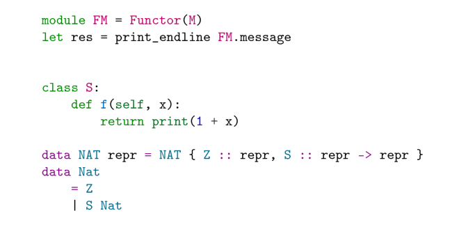

# GkdHighlight

<details>
    
<summary> <h2> Backgroud, Installation and CLI </h2> </summary>

100 trillion words omitted here,

let us present `gkdhighlight`.

It's a syntax highlighting library via [GkdTeX](https://github.com/thautwarm/gkdtex),

which is a programmable TeX compiles to LaTeX.

No LaTeX dependencies other than `xcolor` and `asmmath`,

no shell-escape,

no package conflicts, but—

only normal paragraphs generated and coloured,

you place it in tabular, in commands—

Oh, composability! Reusability!

~~The strong PTSD against its alternatives eventually fades.~~

—but anyway, now,

`pip install pygments gkdtex gkdhighlight` within 0.5 seconds, 

`gkdtex main.tex --out_file main.out.tex`  within 0.5 seconds, 

`latexmk -pdf main.out.tex` within 10 seconds—

faster typesetting and compilation,

longer sleep,

the joy of reasonable programming,

hope your paper got accepted.

</details>


## Preview

```tex

\gkd@usepackage{gkdhighlight}

\begin{document}
...

\gkd@highlight{ocaml}{
    module FM = Functor(M)
    let res = print_endline FM.message
    }


\gkd@loadpygments{colorful}
\gkd@highlight{python}{
    class S:
        def f(self, x):
            return print(1 + x)
}

\gkd@loadpygments{perldoc}
\gkd@highlight{haskell}{
    data NAT repr = NAT { Z :: repr, S :: repr -> repr }
    data Nat
        = Z
        | S Nat
}
```



## Writing Your Own Stylers

In the configuration directory of gkdtex(specified by `gkdtex --config_dir <xxx>`; default to be the directory you call `gkdtex`),
add the following code to your `.gkdrc.py`.

```python
from pygments.style import Style
from pygments import token
def pygments_monkeypatch_style(mod_name, cls):
    import sys
    import pygments.styles

    cls_name = cls.__name__
    mod = type(__import__("os"))(mod_name)
    setattr(mod, cls_name, cls)
    setattr(pygments.styles, mod_name, mod)
    sys.modules["pygments.styles." + mod_name] = mod

    from pygments.styles import STYLE_MAP
    STYLE_MAP[mod_name] = mod_name + "::" + cls_name
 
class YourStyler(Style):
    background_color = "#FFFFAA"
    styles = {
        token.Text: "#AA3939",
        token.String: "#479030",
        token.Keyword: "#A600A6",
        token.Operator: "#246C60",
        token.Number: "#779D34",
        token.Comment: "#AA6F39",
        token.Punctuation: "#DE369D",
        token.Literal: "#4671D5",
    }

pygments_monkeypatch_style("you_gkd_please", YourStyler)
```

Then load it in gkdtex.

```tex
\gkd@loadpygments{you_gkd_please}
```

## Writing Your Own Lexers


Write this in your `.gkdrc.py`.

```python
from pygments.lexer import RegexLexer
from sphinx.highlighting import lexers

keywords = ['lAtEx']

class YourLexer(RegexLexer):
    name = "your_lang"

    tokens = {
        "root": [
            *[(escape(k), token.Keyword) for k in keywords],
            (r"[a-zA-Z_][a-zA-Z_]*", token.Name),
            (r"\s+", token.Whitespace)
        ]
    }
lexers[YourLexer.name] = YourLexer(startinline=True)
```

Then use it in gkdtex.

```tex
\gkd@highlight{your_lang}{ lAtEx is so cool! }
```

### Miscellaneous

Many popular Python distributions are addicted to providing broken `pygments` in their bundles. 
I've appreciated it a lot and you need to reinstall `pygments` again in order to use alternatives to `gkdhighlight`.

Unfortunately, `gkdhighlight` just works if you have Python 3.6+ installed.
