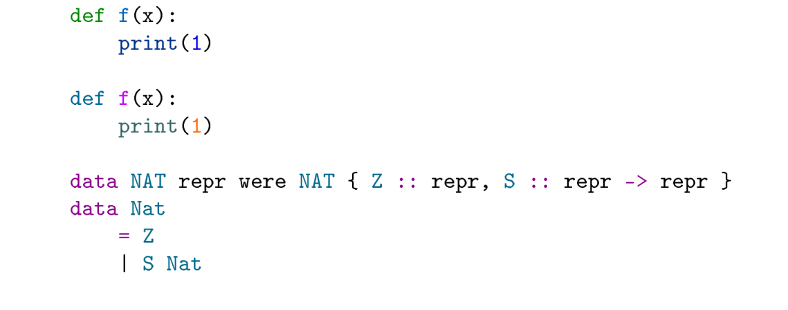

## gkdhighlight

We hereby present `gkdhighlight`, a syntax highlighting library for GkdTeX.

No LaTeX dependencies other than `xcolor` and `asmmath`, no shell-escape, no compatibility issue introduced.

`pip install gkdhighlight` within 0.5 seconds.

```tex

\gkd@usepackage{gkdhighlight}

\begin{document}
...

\gkd@highlight{python}{
def f(x):
    print(1)
}

\gkd@loadpygments{manni}
\gkd@loadpygments{perldoc}

\gkd@highlight{python}{^style manni}{
def f(x):
    print(1)
}

\gkd@highlight{haskell}{^style perldoc}{
data NAT repr were NAT { Z :: repr, S :: repr -> repr }
data Nat
    = Z
    | S Nat
}
```


